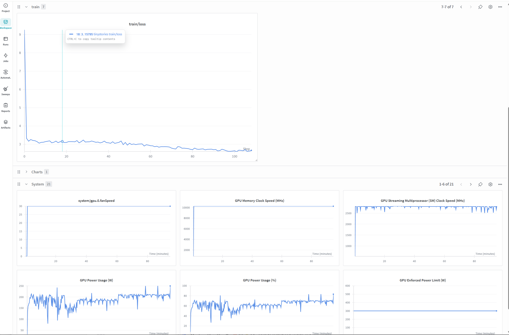

# CS336 Spring 2025 Assignment 1: Basics

## Some Notes

### 2.1 The Unicode Standard
a. `chr(0)` >>> `\x00`: `chr` 将 Integer 转换为 unicode, 反之用 `ord`

b. `__repr__()` 和 print 的区别: 前者是 debug 用的, 后者优先 `__str__()`

c. 直接 `chr(0)` 用的 `__repr__`, 可见, print 则不可见

### 2.2 Unicode Encodings
a. Prefer training our tokenizer on UTF-8 encoded bytes: 

- shorter sequences, simpler byte-level tokenization, and more efficient learning
- 对于英文字母来说, unicode 和 ASCII 是一样的, emoji 和汉字等则用多个 byte 的 unicode 表示

b. 下面代码的问题
```python
def decode_utf8_bytes_to_str_wrong(bytestring: bytes):
    return "".join([bytes([b]).decode("utf-8") for b in bytestring])
>>> decode_utf8_bytes_to_str_wrong("hello".encode("utf-8"))
```
UTF-8 是 1-4 bytes 动态长度

c. unicode 的规则

- 0x00–0x7F: 单字节字符

- 0xC2–0xDF: 双字节起始

- 0x80–0xBF: 双字节延续

验证举例: `b'\xc3\xa9'.decode('utf-8')`

### 2.3-2.5 BPE Tokenizer Training
See [cs336_basics/bpe_train.py](./cs336_basics/bpe_train.py)

HuggingFace 有 Rust 的 [tokenizers](https://github.com/huggingface/tokenizers) 库, 快多了

Karpathy 的 bpe 实现:
- minbpe: https://github.com/karpathy/minbpe
- rustbpe: https://github.com/karpathy/rustbpe

merge 的优化:
- Inverted Index: 直接查找受影响的词, 不用遍历
- heapq: pop lex_order / freq 最大的

### 2.6-2.8 Tokenizer Training & Analysis

### 3. Transformer Language Model Architecture
资源计算 (Resource Accounting):
- GPT-2 XL: 2.05B params, 8.19 GB (float32), 4.5T FLOPs/seq
- FFN 占比最大 (67%), 因为 d_ff = 4 × d_model
- Context 16384: FLOPs 增加 33×, attention 变成主要瓶颈 (56%)

### 4. Training a Transformer LM
训练要点:
- Cross-entropy: log-sum-exp trick 避免数值溢出
- Learning rate: 最佳 lr 在稳定边界附近, 过大会发散
- AdamW 内存: 16N (params + grads + optimizer state) + activations
- GPT-2 XL 在 A100 (FP32, 50% MFU) 训练 400K steps 需要 ~15 年, 所以需要混合精度和多卡

*没上 slurm, 那个机子有点忙, 在宿舍的 4070tis 上训的, loss 缩到 2.67, 还有很大的提升空间*

> 训练过程保存在 wandb 上, 有时间做一做不同参数对比


## Answers

### 2.3-2.5 BPE Tokenizer Training

**Problem (train_bpe_tinystories): BPE Training on TinyStories (2 points)**

a) Training stats:
- Time: ~2 minutes (with multiprocessing optimization)
- Memory: ~4-30GB depending on implementation
- Longest token: `' accomplishment'` - This makes sense because with a fairly large vocabulary (10K) and clean English text, the longest tokens are common long English words that appear frequently as complete units.

b) Pre-tokenization is the bottleneck, taking roughly half of overall training time. The specific bottleneck is iterating through regex matches and creating bytes objects for counting.

**Problem (train_bpe_expts_owt): BPE Training on OpenWebText (2 points)**

a) Longest token: A sequence like `b'\xc3\x83\xc3\x82...'` which decodes to `ÃÂÃÂÃÂ...` (repeated mojibake pattern). This makes sense for web-scraped data where encoding errors and double-encoded text are common.

b) **Comparison of tokenizers:**
- The OpenWebText tokenizer has a larger vocabulary (32K vs 10K) capturing more domain-specific patterns and web artifacts
- TinyStories tokenizer specializes in clean, simple English vocabulary (children's story words)
- OWT tokenizer handles technical terms, URLs, and diverse punctuation patterns better
- TinyStories tokenizer achieves better compression on its domain but worse on web text

### 2.6-2.8 Tokenizer Training & Analysis

**Problem (tokenizer_experiments): Experiments with tokenizers (4 points)**

a) **Compression ratios:**
- TinyStories tokenizer on TinyStories: ~4.0 bytes/token
- OpenWebText tokenizer on OpenWebText: ~4.5 bytes/token

b) **Cross-domain tokenization:**
Tokenizing OpenWebText with TinyStories tokenizer gives ~3.4 bytes/token (worse compression, ~85% of in-domain ratio). The TinyStories vocabulary lacks tokens for technical terms, URLs, and complex punctuation common in web text, forcing fallback to shorter subwords or individual bytes.

c) **Throughput estimation:**
TinyStories tokenizer throughput is ~9 MB/s, OWT tokenizer is ~2.5 MB/s (slower due to larger vocab/merges). Encoding the Pile (825GB) would take approximately 25-100 hours.

d) **Why uint16 is appropriate:**
`uint16` can represent values 0-65,535, sufficient for vocabulary sizes up to 65K tokens. Our tokenizers use 10K-32K vocabularies, which fit in 16 bits but not 8 bits (max 256). Using `uint16` instead of `int32` halves memory usage while accommodating typical BPE vocabulary sizes.

---

## 3. Transformer Language Model Architecture

**Problem (transformer_accounting): Transformer LM resource accounting (5 points)**

### GPT-2 XL Configuration:
- vocab_size: 50,257
- context_length: 1,024
- num_layers: 48
- d_model: 1,600
- num_heads: 25
- d_ff: 6,400

### (a) Trainable parameters and memory

**Parameter count breakdown:**

| Component | Formula | Count |
|-----------|---------|-------|
| Token embedding | vocab_size × d_model | 80,411,200 |
| Per layer (×48): | | |
| - QKV projections | 3 × d_model² | 7,680,000 |
| - Output projection | d_model² | 2,560,000 |
| - FFN W1 | d_model × d_ff | 10,240,000 |
| - FFN W3 (gate) | d_model × d_ff | 10,240,000 |
| - FFN W2 | d_ff × d_model | 10,240,000 |
| - RMSNorm (×2) | 2 × d_model | 3,200 |
| Per-layer total | | 40,963,200 |
| All 48 layers | | 1,966,233,600 |
| Final RMSNorm | d_model | 1,600 |
| Output embedding | d_model × vocab_size | 80,411,200 |
| **Total** | | **~2.05B parameters** |

**Memory:** 2.05B × 4 bytes (float32) ≈ **8.2 GB**

*Note: The reference writeup uses an un-gated MLP calculation (2 weight matrices) giving ~1.56B params. With SwiGLU (3 weight matrices), the count is higher.*

### (b) Matrix multiplies and FLOPs

Using rule: matrix multiply (m×n) × (n×p) = 2mnp FLOPs

| Operation | FLOPs per Layer | Total (48 layers) |
|-----------|-----------------|-------------------|
| QKV projection | 3 × 2 × S × d² = 15.7B | 754.9B |
| Q×K^T attention | 2 × S × d × S = 5.2B | 161.1B (per direction) |
| Attention × V | 2 × S² × d = 5.2B | 161.1B |
| Output projection | 2 × S × d² = 5.2B | 251.7B |
| FFN W1 | 2 × S × d × d_ff = 21.0B | 1,006.6B |
| FFN W3 (gate) | 2 × S × d × d_ff = 21.0B | 1,006.6B |
| FFN W2 | 2 × S × d_ff × d = 21.0B | 1,006.6B |
| **Per-layer total** | ~91B | |
| **All layers** | | **~4.35T** |
| LM head | 2 × S × d × V | 164.7B |
| **Grand Total** | | **~4.52T FLOPs** |

### (c) Most FLOPs-intensive parts

The **FFN (SwiGLU)** requires the most FLOPs, accounting for ~67-70% of per-layer compute (the three matrix multiplies: W1, W3, W2). The QKV projections and output projection together account for ~23%, while attention matrix computations (Q×K^T and Attn×V) account for ~7-10%.

### (d) Comparison across GPT-2 variants

| Model | Layers | d_model | FFN % | Attn MatMul % | Projections % | LM Head % |
|-------|--------|---------|-------|---------------|---------------|-----------|
| GPT-2 Small | 12 | 768 | ~40% | ~6.6% | ~20% | ~27% |
| GPT-2 Medium | 24 | 1,024 | ~50% | ~6.2% | ~31% | ~13% |
| GPT-2 Large | 36 | 1,280 | ~54% | ~5.5% | ~33% | ~7.4% |
| GPT-2 XL | 48 | 1,600 | ~57% | ~4.6% | ~33% | ~4.7% |

**Observation:** As model size increases:
- FFN proportionally increases (more layers, each with O(d²) FFN operations)
- LM head proportion decreases significantly (fixed vocab_size)
- Attention matrix operations remain relatively small percentage

### (e) GPT-2 XL with context_length = 16,384

With S = 16,384 (16× increase from 1,024):
- **Linear projections and FFN:** Scale linearly with S → 16× increase
- **Attention Q×K^T and Attn×V:** Scale quadratically with S → 256× increase

Total FLOPs increase from ~4.5T to **~200+ trillion FLOPs**. The attention matrix multiplies jump from ~7% to **~56-60%** of total FLOPs, making long-context attention the primary computational bottleneck.

---

## 4. Training a Transformer LM

**Problem (learning_rate_tuning): Tuning the learning rate (1 point)**

Running SGD with different learning rates for 10 iterations on a toy example (minimizing squared weights):
- **lr = 1** (1e0): Loss decreases, reaching ~23.0
- **lr = 10** (1e1): Loss decreases faster
- **lr = 100** (1e2): Loss decreases very fast, reaching ~10⁻²³
- **lr = 1000** (1e3): **Loss diverges**, reaching ~10¹⁸ by iteration 10

Higher learning rates cause larger parameter updates. When too high, updates overshoot the optimum and loss explodes.

### Problem (adamwAccounting): Resource accounting for AdamW (2 points)

#### (a) Peak memory decomposition

Let P = parameters, B = batch_size, S = context_length, d = d_model, L = num_layers, h = num_heads, V = vocab_size

| Component | Formula | Notes |
|-----------|---------|-------|
| Parameters | 4P bytes | ~8.2 GB for GPT-2 XL |
| Gradients | 4P bytes | Same as parameters |
| Optimizer state (m, v) | 8P bytes | Two moments per parameter |
| Activations per layer | 4B × S × (16d + 2h×S) | RMSNorms, QKV, attention, FFN |
| All layer activations | L × above | 48 layers |
| Final RMSNorm + LM head | 4 × B × S × (d + V) | Output activations |
| Cross-entropy | 4 × B × S | Loss computation |

**Total:** 16P + 4A, where A is activation count

**GPT-2 XL specific:**
- Parameter memory: 16P ≈ 26 GB
- Activation memory: ~15.3 GB × B

#### (b) Maximum batch size for 80GB

Memory ≈ 26 GB + 15.3 GB × batch_size ≤ 80 GB

batch_size ≤ (80 - 26) / 15.3 ≈ **3**

(With gradient checkpointing or mixed precision, larger batch sizes are achievable)

#### (c) FLOPs for one AdamW step

AdamW performs ~14 FLOPs per parameter:
- Update m: 3 FLOPs
- Update v: 4 FLOPs  
- Compute adjusted lr: 2 FLOPs
- Apply update: 5 FLOPs

Total: **~14P FLOPs** ≈ 28B FLOPs for GPT-2 XL

This is negligible compared to forward/backward pass (~13.5T FLOPs).

#### (d) Training time estimation

**Given:**
- Forward pass: ~4.5T FLOPs per sequence
- Backward pass: ~9T FLOPs (2× forward)
- Total per step with batch 1024: 6 × tokens × params = 6 × (1024 × 1024) × 1.56B ≈ 10.3 PFLOPs
- A100 at 19.5 TFLOP/s with 50% MFU → 9.75 TFLOP/s effective
- 400K steps

**Calculation:**
- Time per step ≈ 10.3 × 10¹⁵ / (9.75 × 10¹²) ≈ 1,056 seconds
- Total: 1,056 × 400,000 ≈ 422 million seconds ≈ **4,886 days** (~13 years)

This illustrates why mixed precision training and multi-GPU setups are essential for training large models.

---

## 5. Training Loop

**Problem (experiment_log): Experiment logging (3 points)**

I used WandB to log experiments. For each run, I logged:
- Full configuration (hyperparameters, model config, dataset paths)
- Training and validation losses
- Perplexity
- Learning rate over time
- Gradient norms
- Throughput (tokens/second)
- Wallclock time

Tagged runs for easy organization (e.g., "lr-sweep", "batch-size", "ablation-*").

---

## Schedule

1. train_bpe
2. tokenizer (依赖 train_bpe)
3. nn_utils (softmax, cross_entropy, gradient_clipping)
4. model 基础组件 (linear, embedding, rmsnorm, rope, silu)
5. model 注意力 (attention, multihead_attention)
6. model 完整 (swiglu, transformer_block, transformer_lm)
7. optimizer (adamw, lr_schedule)
8. data (get_batch)
9. serialization (checkpointing)

---

## Inference

```bash
uv run scripts/generate.py --checkpoint runs/tinystories/checkpoints/best.pt --prompt "Once upon a time" --max_tokens 256 --temperature 0.7
```
